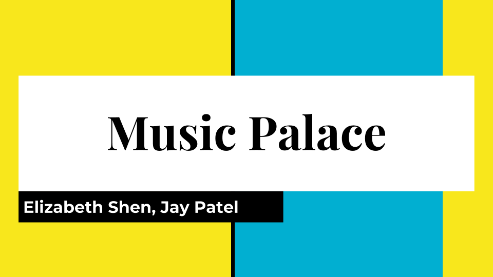
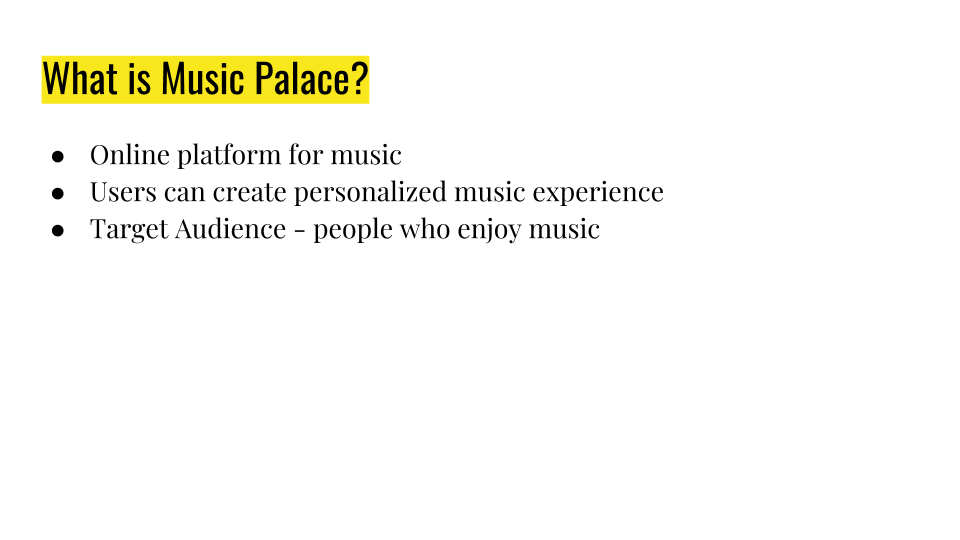
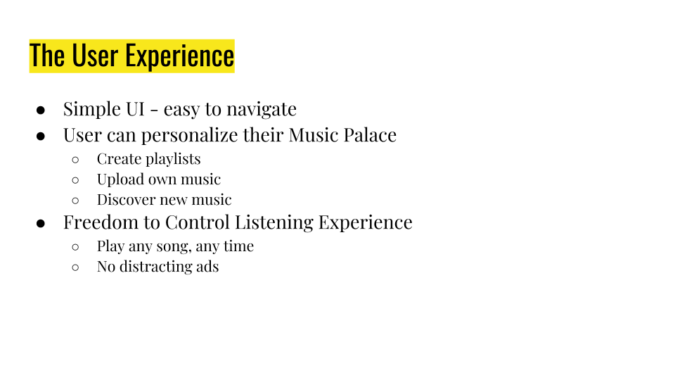
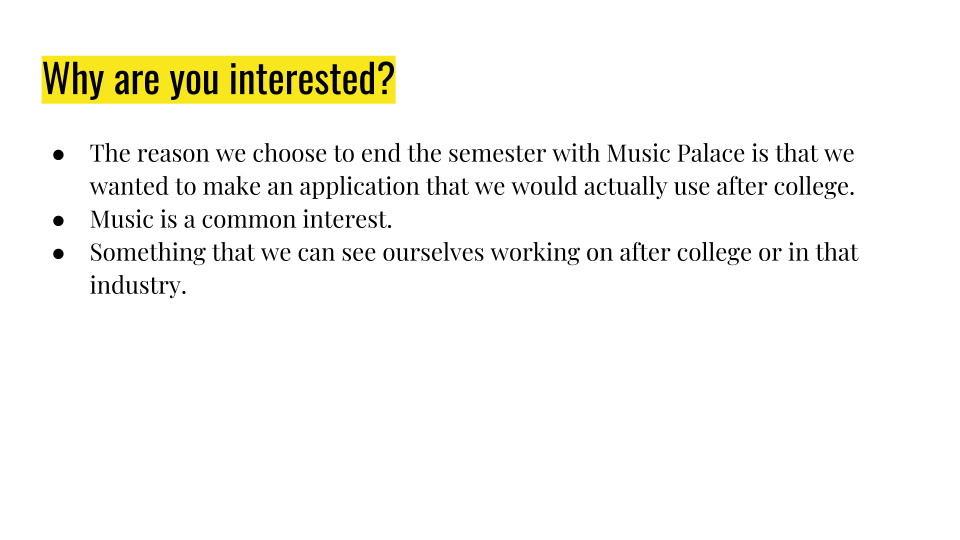

Jay Patel, Elizabeth Shen

CMSI 402 ~ Professor: Johnson

Section 3.0
<h3>
Project Proposal</h3>

Nowadays the top music platforms are overwhelmed with unnecessary features and ads that distract from the user’s listening experience. As avid music listeners, Elizabeth and I find most of these platforms to be clunky and unappealing. They also contain distracting ads that disrupt the mood and feel of music. When someone is listening to a playlist of someone such as Muse no one wants a car commercial to pop up and ruin the flow of the music. We decided we wanted to make our own music platform called Music Palace; designed for simplicity and to be completely ad-free. This will separate us from the bigger platforms that require a user to usually purchase a premium if they want ad free music or use a 3rd party application such as ad block.
Music Palace will utilize technologies such as HTML, JS, CSS, and Neo4j. We will be obtaining the music from Spotify’s API for the beginnings of this project because of the sheer volume of music there is as well as copyright issues. We will be integrating the database for user playlists and keeping that data organized. Our project will also have user login and authentication, playlist management, uploading and listening to audio files. Music Palace will initially be designed as a desktop application, with the possibility of extending to mobile.

Our project will demonstrate the skills we have acquired from Senior project (401), Databases, and Interaction design. The reason this project is in scope is because we have already worked on a web application and we both have some knowledge on JS, HTML, CSS, Neo4j, API calls, and user authentication. If we did not have some prior knowledge I feel the project would have to high of a learning curve to get done with just two people in one semester. Although we have prior knowledge to most of these technologies they have so much to offer and so many libraries and features that it is basically like learning the language all over again. Music Palace will appeal to anyone who is interested in organizing and listening to their favorite music. Since most people use music as part of their daily lives, this is a very wide audience who will benefit from Music Palace. 

Presentation

