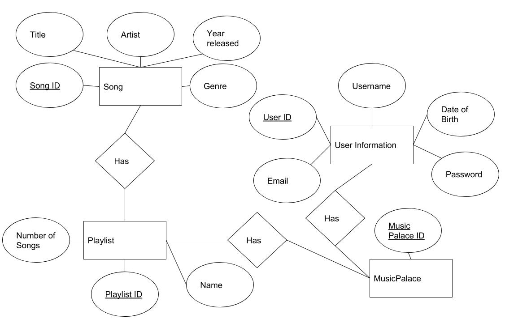
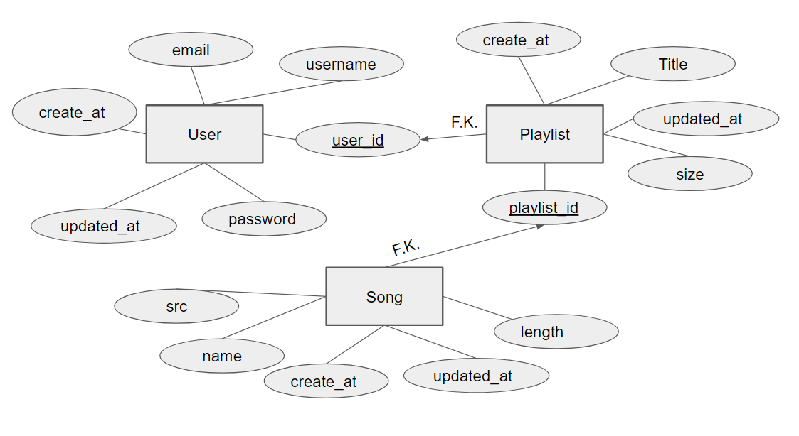

## 6.1      Introduction

This Software Design Description (SDD) presents the architecture and detailed design for the software for MusicPalace. MusicPalace is a personal online database and music player that allows users to store, sort, and listen to their favorite songs. A MusicPalace user will be able to upload songs and store them in their playlists. MusicPalace will have a sleek format and allow users to easily access and listen to their songs. Making a playlist will allow a user to enter in as many songs as they would life. MusicPalace will also allow for sharing music playlists with other users. The MusicPalace system architecture is comprised of a CSS/JS/HTML graphical user interface, a Node server, and a Neo4j database.

## 6.1.1     System Objectives

The system objective of MusicPalace is to serve as a online database for music that allows user to access and listen to their music as well as keep it in orderly fashion. Our project will allow for users to easily add their songs to their playlists. MusicPalace should allow for a enjoyable user experience that is easy to use.

## 6.1.2     Hardware, Software, and Human Interfaces

| Interface Type | Interface Description |
|---|---|
| Human Interface | keyboard and mouse |
| Human Interface | monitor |
| Software | Google Chrome |
| Hardware | Computer |

## 6.2       Architectural Design

The Music Palace graphical user interface will be constructed using javascript and the Bootstrap toolkit.
Music Palace will be using Napster services to search and play songs. Music Palace will use a Neo4j database to store its data.

## 6.2.1     Major Software Components

- Login Page
  - A login page will be displayed to the user.
- Home Page
  - The Frontend shall provide a brand new user with a homepage that will be customizable.
- Sign Up button
  - A sign up button that the user can click to sign up.
- Search Song
  - This component will allow the user to search for music to add to their playlists
- List Module
  - This list module will display a list of the users playlists
- New playlist button
  - This button will allow the user to create a new playlist
- Music player
  - A music player at the bottom of the screen to allow a user to play the song

## 6.2.2     Major Software Interactions

- Login Page
  - A login page will be displayed to the user. The login page will have entry fields for the user to enter login information. The login page will also have a Sign Up button for the user to create an account.
- Home Page
  - A user will have a home page displayed and on the left side will be the users playlists in which they can click on and a search bar to search up songs
- Sign Up button
  - A sign up button will take the user to the sign up page and then have text fields to allow the user to register
- Search Song
  - After the user has searched the song the user can click the add button to add it to their playlist
- List Module
  - Clicking on a playlist in the users list module will change the playlists
- New playlist button
  - Clicking the new playlist button will allow the user to input a name for the playlist and then be displayed on the list module list
- Music player
  - A music player at the bottom of the screen that can be clicked to play, pause, go back, or forward from the current song

## 6.2.3     Architectural Design Diagrams

## 6.3.      CSC and CSU Descriptions

- Front End CSC -- web-based GUI for MusicPalace
  - Login/Join CSU -- page for users to log in or sign up for a MusicPalace account
  - HomePage CSU -- page for users to view their homepage
    - Playlist list module -- displays the user's playlists
    - Playlist info module -- displays the songs in the playlist
    - Playlist input module -- input field for adding new links to a playlist
- Server CSC
  - Node.js CSU -- modules for handling http(s) connections and requests
  - API Routes CSU --  modules for handling API requests to the server and database
- Database CSC
  - Neo4j CSU -- modules for filtering/modeling the data for storage in database
  - queries CSU -- modules for handling queries on the database

## 6.3.1     Class Descriptions

- 6.3.1.1 Front Page
  - Login Class -- This class has the GUI for MusicPalace's login page as well as sending the data to our database for authentication when logging in
  - Join Class -- This class has the GUI for MusicPalace's sign up page and also sends and saves the data to our database to register this user
- 6.3.1.2 Home Page
  - Home Page -- This class is the GUI for each persons playlist and songs and contains a recommendation for the user
    - Search bar Class -- Has the GUI for the search bar
    - List Class -- Has the GUI for the list class
- 6.3.1.3 Account Class -- Talks to our account Database the fetch user info and deals with stuff such as authentication, changing profile name and pictures, deleting an account, and playlists.
- 6.3.1.4 Playlists Class -- Deals with the storage of songs and managing playlists

## 6.3.2     Detailed Interface Descriptions

- Front End CSC
  - Login/Join CSU -- This page will allow the users the log in or sign up for a Music Palace account. There will be a form that will ask for the username and password, with a Login Button underneath. When the user logs in to their account, they will be taken to the Home Page. If the user chooses to Join, a new form will appear for the user to enter their information. When a new user joins, they will be taken to the Home Page displaying a search bar for the user to search for a song.
  - Home Page CSU -- The Home Page CSU will have a side bar that displays all of the user's playlists. The first playlist displayed will automatically default to the user's first playlist that was created. The playlist will show a list of all the songs that are saved under that playlist. The Home Page will also have a search bar that allows the user to search for more songs.
    - Search Bar module -- The Search Bar module will be comprised of a search bar with a button that prompts the user to search for songs. When the user enters a search term and presses the 'search' button, the user will be directed to the Search Results CSU.
  - Search Results CSU -- The Search Results CSU will show a list of song titles accompanied by an icon that shows an image of the album's cover that the song belongs to. Each song will have a 'play' button next to it, that will allow the user to play the song. Each song will also have an 'add to playlist' option.
  - Playlist Display module -- The Playlist Display module will display all the songs that are included in a certain playlist. The Playlist Display module will have a 'shuffle' button that will play all the songs in the playlist in shuffled order. The Playlist Display Module will also have an 'edit' button that will allow users to delete songs from the selected playlist.

## 6.3.3     Detailed Data Structure Descriptions

- User Data Structure
  - User_id -- This is the index for individual user, this is unique
  - Email -- This is the user's email that the user inputs when they sign up for their account. This is used for the login and provides uniqueness for each users. Emails has to be unique and valid which our database would check and no email could be used twice to make a second account. It accepts any existing email format that seems similar to abc123@something.com. It is saved as a string in the database
  - Username -- This is user's username that does not have to be unique and the user can change any time they want. It is saved as a string in the database
  - Password -- This is user's password that the user inputs when they sign up for their account. It consists of special characters, letters, and numbers. It is saved as a string in the database
  - Created_at -- The date and timestamp that the user account was created at. This holds datetime value
  - Updated_at -- The date and timestamp that the user account has been modified at. This can be either change of password or username. This holds datetime value

- Playlist Data Structure
  - Title -- This is the name of the Playlist, it does not have to be unique. This is a string value
  - Size -- Size is how many song are inside of the database. This holds an integer
  - Update -- Called when the playlist is updated and adds songs to the current playlist

## 6.3.4     Detailed Design Diagrams

## 6.4       Database Design and Description

The MusicPalace database contains users, playlists, and songs. The database we are using at the moment is Neo4j, because we want to show relations between songs so we can recommend songs to the user on their homepage. The database itself is being designed in the standard of Neo4j, which can be used to find relationships and implement some machine learning.

## 6.4.1     Database Design ER Diagram

## 6.4.2     Database Access

Music Palace's database access is handled through two main methods:
- Automatic queries:
  - These are the queries performed when creating the database and when there is data being added to, modified, or removed from the database.
  - Any person who uses the application will be accessing the database in this manner.
- Migrations:
  - These are Neo4j queries that allow a person to change the database schema without disrupting the application or the data.
  - Only those with access to the development of the Music Palace application will have the ability to perform migrations.

## 6.4.3     Database Security

We will be using OAuth for the database security.
